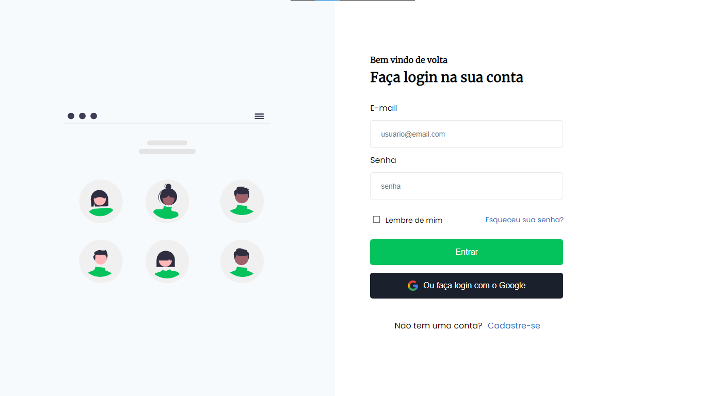
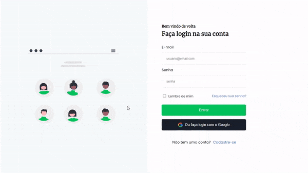

<h2 align="center">
  Desafios Codelândia
</h2>

  Objetivo dos desafios é ajudá-lo a melhorar suas habilidades fazendo mini projetos semanais.

  <a href="https://discord.com/invite/QevDJqCzaY">Entre na nossa comunidade!</a>

---

## 🎯 Índice de desafios

* [Desafio 01 - Blog](https://github.com/Mateuss18/Desafio01_Codelandia-Blog)
* [Desafio 02 - JordanShoes](https://github.com/Mateuss18/Desafio02_Codelandia-JordanShoes)
* [Desafio 03 - HallowenPedia](https://github.com/Mateuss18/Desafio03_Codelandia-HalloweenPedia)
* [Desafio 04 - Login Page](https://github.com/Mateuss18/Desafio04_Login-Page)
---

### **Desafio 04 - Login Page** 

Link do desafio no Figma: [Clique aqui](https://www.figma.com/file/Yb9IBH56g7T1hdIyZ3BMNO/Desafios---Codelândia?node-id=4588%3A37)

>
---
<h2 align="center">
  Tecnologias
</h2>

>
---
## 📝 Licença

Esse projeto está sob a licença MIT. Veja o arquivo [LICENSE](LICENSE) para mais detalhes.

---

Feito com 💜 by **Codelândia** [Entre na nossa comunidade!](https://discord.com/invite/QevDJqCzaY)
